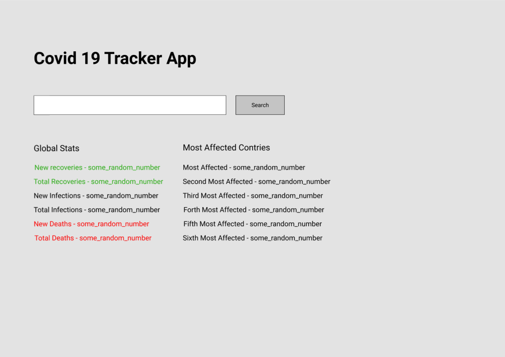
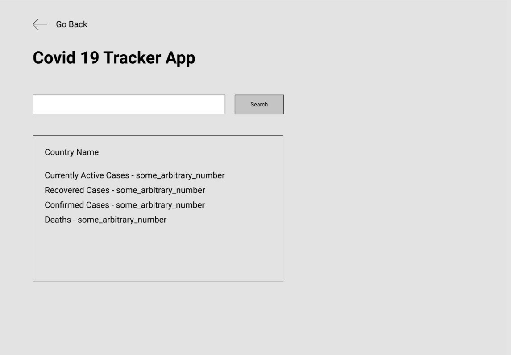

# Covid19TrackerWPF

This project is made to have a desktop Windows App to track Covid Information 
on your fingertips and you can gaze and get information in a few clicks. 
Behind the scenes it uses Postman API's. This is in no intention made to be a 
production quality app and is just made for educational and learning purpose:).

I have made Mockups for this app and they look like this. [Not a designer so 
forgive my designing skills. Still designing helps me understand what i have 
to make and stops me from making something random only 🤣]

Here is the mockup design ->

1. Main Page Design 
   

2. Details Page Design 

